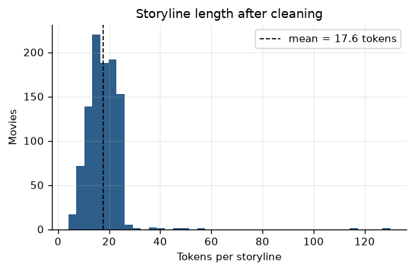
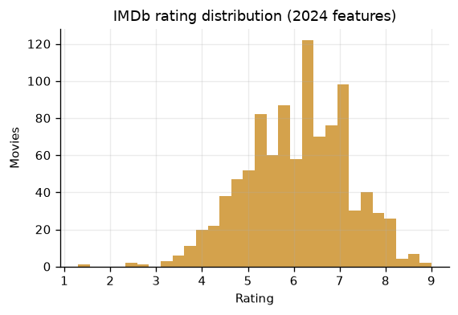
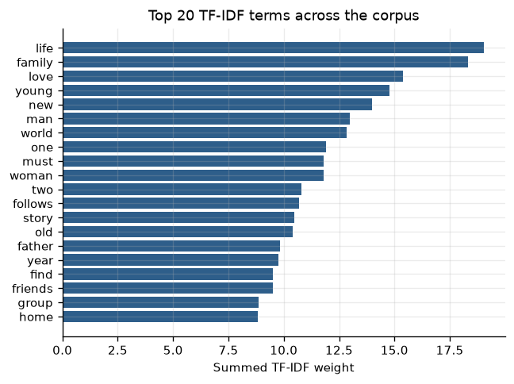
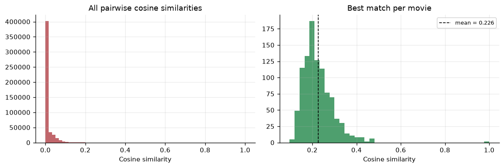
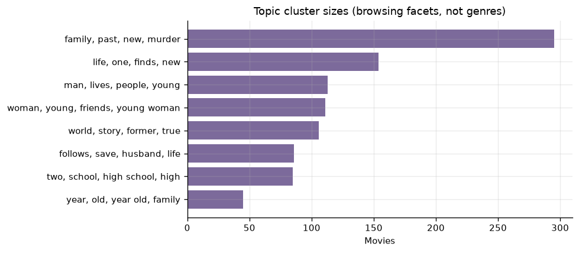

# IMDB Movie Recommendation System Using Storylines

Recommend the top-5 most similar movies from a free-text plot description,
using NLP text cleaning, TF-IDF vectorisation and cosine similarity, served
through a five-page Streamlit interface.

---

## 1. Project Overview & Architecture

### Problem statement

Given a storyline — either typed by the user or belonging to an existing film —
surface the movies whose plots are most semantically similar. The corpus is
collected from IMDb's 2024 feature-film listing with Selenium, cleaned with an
NLP pipeline, and compared with cosine similarity over TF-IDF vectors.

### Approach

| Stage | What happens |
|---|---|
| Scrape | Selenium drives Chrome across the IMDb 2024 advanced-search page, clicking "50 more" 19 times to load 1,000 titles, then extracting **movie name**, **storyline**, year, runtime, IMDb rating and vote count into `data/imdb_2024_movies.csv` |
| Clean | Lower-case → strip punctuation and digits → remove stop words → drop tokens shorter than 3 characters → drop empty/duplicate records |
| Vectorise | `TfidfVectorizer` (unigrams + bigrams, `sublinear_tf`, `min_df=2`, `max_df=0.4`, max 8,000 features). `CountVectorizer` is available as an alternative via `build_vectoriser(method="count")` |
| Similarity | Full pairwise `cosine_similarity` matrix, diagonal zeroed so a movie never recommends itself |
| Cluster | `KMeans` topic clustering over the same TF-IDF matrix, labelled by each centroid's highest-weight terms |
| Serve | Streamlit UI with free-text and title-based recommendation modes |

### Architecture

```
        IMDb 2024 search page
                 │  Selenium (visible Chrome — see WAF note below)
                 ▼
   data/imdb_2024_movies.csv   ── 995 rows: imdb_id, movie_name,
                                   storyline, release_year, runtime,
                                   imdb_rating, vote_count
                 │
                 ▼  clean_text()
   lower-case → de-punctuate → stop-words → token filter
                 │
                 ├──▶ data/cleaned_movies.csv
                 ├──▶ MySQL :3306 / SQLite  (table: movies)
                 │
                 ▼  TfidfVectorizer
        TF-IDF matrix  (n_movies × vocabulary)
                 │
     ┌───────────┴─────────────┐
     ▼                         ▼
cosine_similarity          KMeans topics
     │                         │
     ▼                         ▼
artifacts/cosine_similarity.pkl
artifacts/tfidf_vectorizer.pkl
artifacts/tfidf_matrix.pkl
artifacts/topic_kmeans.pkl
artifacts/title_index.pkl
                 │
                 ▼
              app.py  (Streamlit, 5 pages)
```

### Two things that broke, and how they are handled

**1. IMDb's WAF blocks headless Chrome.** Requesting the search page with
`--headless=new` returns a 9 KB AWS WAF page titled *"Human Verification"* —
zero result cards. A normal visible Chrome window loads the real page. The
scraper therefore runs **non-headless by default** (`IMDB_HEADLESS=0`) with
`--disable-blink-features=AutomationControlled` and the `navigator.webdriver`
flag suppressed. If the WAF page is detected anyway, `scrape_imdb()` raises
with a message telling you exactly what to change. No CAPTCHA is bypassed or
solved — the scraper simply behaves like a browser and stops if challenged.

**2. `WebElement.text` returns empty for off-screen cards.** After expanding
to 1,000 cards, only the ~10 in the viewport return text; the rest yield `""`,
which silently produced a zero-row scrape. Two fixes: everything is read via
`textContent` (layout-independent), and the whole extraction runs as **one
`execute_script` pass** rather than 5,000 WebDriver round-trips.

Related: IMDb no longer wraps titles in `<h3>`, so the selector is the
class `.ipc-title__text` on whatever element currently carries it.

### Public API

```python
from models import recommend_by_text, recommend_by_title

recommend_by_text("A detective uncovers a buried recording…", top_k=5)
recommend_by_title("Silent Inheritance Part Two", top_k=5)
```

Both return a DataFrame of `movie_name`, `storyline` and `similarity`.

### Database schema

```sql
movies (
  movie_id      INTEGER PRIMARY KEY,
  movie_name    VARCHAR(255) NOT NULL,
  storyline     TEXT,
  cleaned_story TEXT,
  genre_hint    VARCHAR(60),
  release_year  INT
);
```

---

## 2. How to Execute the Project

### Prerequisites

* Python 3.10 – 3.14
* Google Chrome **(only needed for `--scrape`)** — Selenium Manager downloads
  a matching chromedriver automatically
* MySQL 8.x (**optional** — SQLite fallback is automatic)

### Step-by-step

```bash
# 1. Clone and enter the project
git clone https://github.com/prawin0309/IMDB-Movie-Recommendation-System-Using-Story-lines.git
cd IMDB-Movie-Recommendation-System-Using-Story-lines

# 2. Create and activate a virtual environment
python -m venv .venv
.venv\Scripts\Activate.ps1        # Windows PowerShell
source .venv/bin/activate         # macOS / Linux

# 3. Install dependencies
pip install -r requirements.txt

# 4a. Build from the committed corpus (995 movies already scraped)
python data_pipeline.py

# 4b. …or re-scrape IMDb live with Selenium, then clean and load
#     (opens a visible Chrome window; takes ~90 seconds)
python data_pipeline.py --scrape

# 5. Fit TF-IDF, the cosine-similarity matrix and topic clusters
python models.py

# 6. Launch the application
streamlit run app.py
```

Expected output from step 5:

```
[data] 995 movies loaded
[tfidf] matrix shape = (995, 2961) (14603 non-zero entries)
[save] tfidf_vectorizer.pkl
[save] cosine_similarity.pkl
[cluster] k=8  silhouette=0.0029
[similarity] mean off-diagonal similarity = 0.0093
Model training completed successfully.
```

### Scraping notes

`scrape_imdb()` waits on `li.ipc-metadata-list-summary-item`, clicks the
"see more" button until `SCRAPE_MAX_MOVIES` titles are loaded (19 clicks for
1,000), then extracts every card in a single JS pass. Of 1,000 cards, 995 had
a usable storyline; 5 were skipped. If Chrome is missing or IMDb changes its
markup, the pipeline catches the exception, prints the reason, and continues
with the committed corpus — so the project never fails closed.

---

## 3. Test Credentials & System Configurations

This is a public recommender with **no login wall** — an evaluator can open it
and start typing storylines immediately. Credentials below cover the database
layer.

### Database configuration

| Setting | Default | Environment variable |
|---|---|---|
| Host | `localhost` | `IMDB_DB_HOST` |
| Port | `3306` | `IMDB_DB_PORT` |
| User | `root` | `IMDB_DB_USER` |
| Password | `root` | `IMDB_DB_PASSWORD` |
| Database | `guvi_db` | `IMDB_DB_NAME` |
| Backend | `auto` (`mysql` \| `sqlite`) | `IMDB_DB_BACKEND` |

`guvi_db` is created automatically when missing.

```bash
export IMDB_DB_BACKEND=mysql IMDB_DB_USER=root IMDB_DB_PASSWORD=your_password
python data_pipeline.py
```

### Application & scraper configuration

| Setting | Default | Constant |
|---|---|---|
| Streamlit URL | `http://localhost:8501` | — |
| IMDb year | `2024` | `IMDB_YEAR` |
| Max movies scraped | `1000` | `SCRAPE_MAX_MOVIES` |
| Headless Chrome | `False` (WAF) | `IMDB_HEADLESS` env var |
| Selenium wait timeout | `30 s` | `SCRAPE_TIMEOUT` |
| Max "see more" clicks | `40` | `SCRAPE_MAX_CLICKS` |
| Recommendations returned | `5` | `TOP_K` |
| TF-IDF max features | `8000` | `TFIDF_MAX_FEATURES` |
| TF-IDF n-gram range | `(1, 2)` | `TFIDF_NGRAM_RANGE` |
| TF-IDF min / max document frequency | `2` / `0.4` | `TFIDF_MIN_DF`, `TFIDF_MAX_DF` |
| Topic clusters | `8` | `N_CLUSTERS` |
| Random seed | `42` | `RANDOM_SEED` |

### Ready-made test input

Paste this into the **Recommend by Storyline** page:

```
A detective investigating a series of disappearances in a small town uncovers
a buried recording that links every victim to the same conspiracy, and the
people who paid the witnesses to forget.
```

---

## 4. Results

| Metric | Value |
|---|---|
| Movies scraped from IMDb 2024 | **995** (of 1,000 cards; 5 had no storyline) |
| Mean storyline length | 17.6 tokens after stop-word removal |
| TF-IDF matrix | 995 × 2,961, 14,603 non-zero entries |
| Mean off-diagonal cosine similarity | 0.0093 |
| Topic clusters | 8, silhouette **0.0029** |

Discovered topic facets (top TF-IDF terms per centroid) include
*town / small / story*, *family / new / find*, *killer / murder / serial*,
*night / christmas / romance* and *school / high school / teacher* — all
recovered without any genre labels.

### An honest note on the clustering score

The silhouette of **0.003** is near zero, and it is reported rather than
tuned away. IMDb blurbs average ~18 tokens after cleaning, so the TF-IDF space
is extremely sparse and KMeans finds almost no geometric separation. That is a
property of short-text data, not a bug.

The clusters are still useful as **browsing facets** — the term groupings above
are clearly coherent — but they are not hard genre boundaries, and the
recommender does not use them. Recommendation quality comes from pairwise
cosine similarity, which returns sensible neighbours (e.g. a detective /
disappearance / conspiracy query surfaces *Caddo Lake*, *Blackwater Lane* and
*Grave Torture*). `models.py` prints this caveat at runtime.

Absolute similarity values are low (0.10–0.18) for the same reason: two
18-token blurbs rarely share much vocabulary. What matters is the *ranking*,
not the magnitude.

## 5. Tech Stack

Python · Pandas · NumPy · scikit-learn (TF-IDF, cosine similarity, KMeans) ·
Selenium · Streamlit · Plotly · mysql-connector-python · SQLite

> **Note:** SQLAlchemy is intentionally not used. Database access is
> cursor-based through `mysql-connector-python` (or `sqlite3` for the
> portable fallback).

<!-- FIGURES:START -->

## Visualizations

Generated by `make_figures.py` from the cleaned dataset and saved artifacts. Re-run it after the pipeline to refresh every image:

```bash
python make_figures.py
```

### Storyline length



Storyline length after cleaning - a mean of ~18 tokens is why the TF-IDF space is extremely sparse.

### Rating distribution



IMDb rating distribution across the scraped 2024 features.

### Top tfidf terms



Highest-weight TF-IDF terms across the corpus.

### Similarity distribution



Pairwise cosine similarity, and the best match found for each movie. Absolute scores are low by construction on 18-token blurbs; what matters is the ranking.

### Topic clusters



Topic cluster sizes. Silhouette is 0.0029, so these are presented as browsing facets, not genre boundaries.

<!-- FIGURES:END -->
